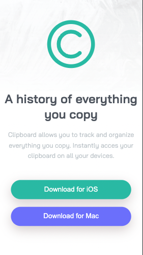
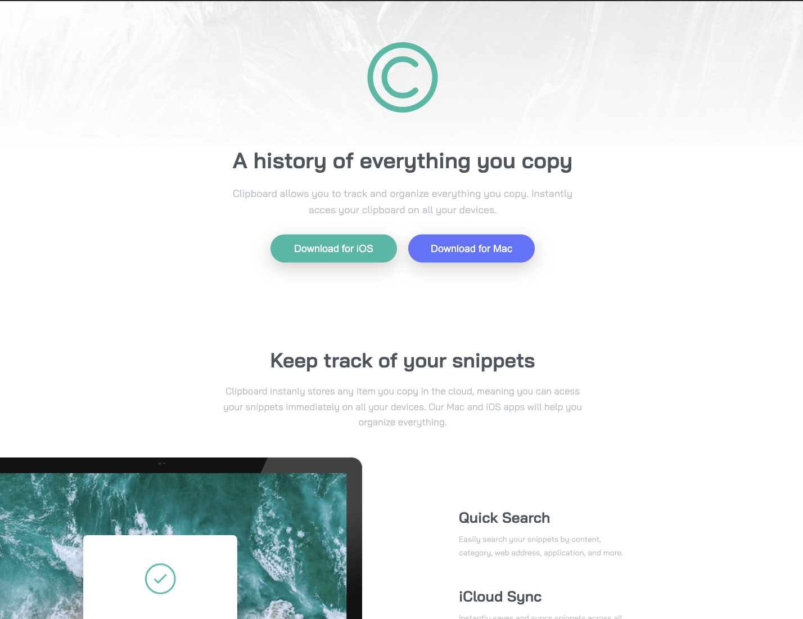

# Frontend Mentor - Clipboard Landing Page

---

## Table of Content

* [Useful Links](#useful-links)
* [Mobile version](#mobile)
* [Desktop version](#desktop)

---

### Useful Links 

* [FM - Clipboard Landing Page](https://www.frontendmentor.io/challenges/clipboard-landing-page-5cc9bccd6c4c91111378ecb9)

* [Vercel: My Solution](https://13-clipboard-landing-page.vercel.app/)

--- 
### Mobile version 

--- 
### Desktop version 

